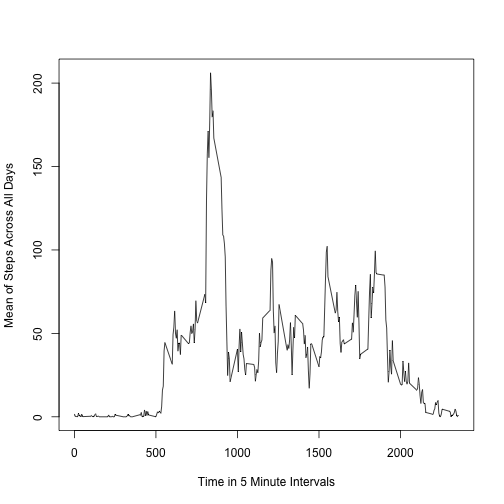

## Loading and preprocessing the data
First the data must be loaded into R, and the dates must be interpreted as dates.


```r
library("dplyr", lib.loc="/Library/Frameworks/R.framework/Versions/3.1/Resources/library")
fitnessData <- read.csv("activity.csv")
fitnessData$date <- as.Date(fitnessData$date, "%Y-%m-%d")
```


## What is mean total number of steps taken per day?

```r
totalSteps <- sum(fitnessData$steps, na.rm=TRUE)
stepsPerDay = summarize(group_by(fitnessData, date), steps = sum(steps, na.rm=TRUE))
meanStepsPerDay <- mean(stepsPerDay$steps)
medianStepsPerDay <- median(stepsPerDay$steps)
hist(stepsPerDay$steps, xlab="Steps Per Day")
```

 

The total number of steps taken is 570608.  The mean number of steps per day is 9354.2295082.  The median number of steps per day is 10395.

## What is the average daily activity pattern?

```r
stepsPerInterval = summarize(group_by(fitnessData, interval), meanSteps = mean(steps, na.rm=TRUE))
plot(stepsPerInterval$interval, stepsPerInterval$meanSteps, type="l", xlab="Time in 5 Minute Intervals", ylab="Mean of Steps Across All Days")
```

 

```r
maxSteps <- max(stepsPerInterval$meanSteps)
maxStepsInterval <- filter(stepsPerInterval, meanSteps==maxSteps)$interval
```
The maximum value of the average steps taken per 5-minute interval is 206.1698113 and occurs during time interval 835.

## Inputing missing values

```r
isNaSteps <- is.na(fitnessData$steps)
countOfNASteps <- length(fitnessData$steps[isNaSteps])
isNaDates <- is.na(fitnessData$date)
countOfNADates <- length(fitnessData$date[isNaDates])
isNaInterval <- is.na(fitnessData$interval)
countOfNAIntervals <- length(fitnessData$interval[isNaInterval])
```
There are 2304 missing values in the steps column, 0 in the intervals column, and 0 in the date column.

We will attempt to clean this up by replacing NA values with the mean value for that time interval.  


```r
fillInValues <- function(fitnessDF, meanIntervsDF) {
    for (i in seq_along(fitnessDF$steps)) {
       if(is.na(fitnessDF$steps[i])) {
          interv <- fitnessDF$interval[i]
          meanValue <- filter(meanIntervsDF, interval==interv)$meanSteps
          fitnessDF$steps[i] <- meanValue
      }
    }
    fitnessDF
}
filledInFitnessData <- fitnessData
filledInFitnessData <- fillInValues(filledInFitnessData, stepsPerInterval)

filledInStepsPerDay = summarize(group_by(filledInFitnessData, date), steps = sum(steps))
filledInMeanStepsPerDay <- mean(filledInStepsPerDay$steps)

filledInMedianStepsPerDay <- median(filledInStepsPerDay$steps)

hist(filledInStepsPerDay$steps, xlab="Steps Per Day")
```

 

Now that the NA values in the original data set have been replaced with the average for that time interval, the median and mean should be recomputed.  The mean number of steps per day is now calculated to be 1.0766189 &times; 10<sup>4</sup>, and the median is now 1.0766189 &times; 10<sup>4</sup>.  Both of these values have increased compared to their non-NA-filled-in versions.   

## Are there differences in activity patterns between weekdays and weekends?

First a factor must be added to delineate weekdays from weekend days.

```r
fifdDays <- mutate(filledInFitnessData, dayOfWeek = weekdays(date))

dayIdentifier <- function(df) {
    df <- mutate(df, weekendOrNot = "blah")
    for (i in seq_along(df$dayOfWeek)) {       
        if(df$dayOfWeek[i]=="Saturday" || df$dayOfWeek[i]=="Sunday") {
            df$weekendOrNot[i] <- "Weekend"
        } else {
            df$weekendOrNot[i] <- "Weekday"
        }
    }
    df$weekendOrNot <- as.factor(df$weekendOrNot)
    df
}

fifdDays <- dayIdentifier(fifdDays)
```

Having now created a factor variable, we use it to plot the data for weekdays and weekends separately.


```r
library(lattice)
justTheWeekend <- filter(fifdDays, weekendOrNot=="Weekend")
justTheWeekdays <- filter(fifdDays, weekendOrNot=="Weekday")
stepsPerIntWeekend = summarize(group_by(justTheWeekend, interval), meanSteps = mean(steps))
stepsPerIntWeekday = summarize(group_by(justTheWeekdays, interval), meanSteps = mean(steps))
stepsPerIntWeekend <- mutate(stepsPerIntWeekend, weekendOrNot="Weekend")
stepsPerIntWeekday <- mutate(stepsPerIntWeekday, weekendOrNot="Weekday")
stepsDays <- merge(stepsPerIntWeekday, stepsPerIntWeekend, all=TRUE)
xyplot(meanSteps ~ interval | factor(weekendOrNot), stepsDays, type="l", layout=c(1,2))
```

 

The data shows that average patterns vary somewhat between weekends and weekdays.
